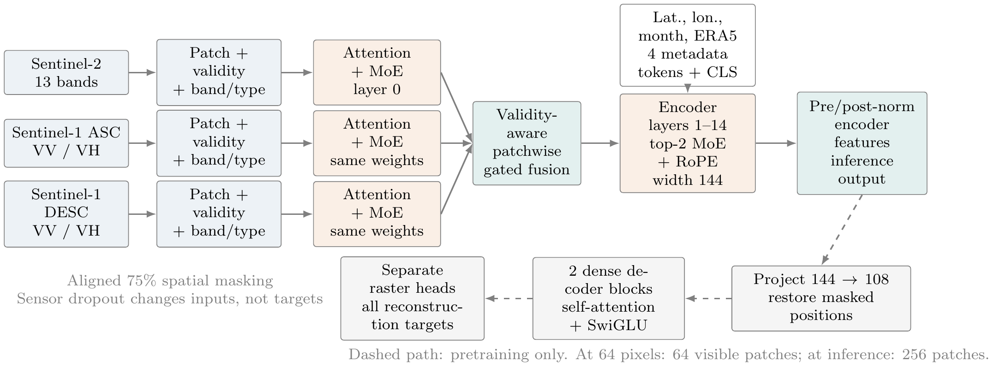

# MEOX

MEOX (Multimodal Earth Observation with eXperts) is a compact multimodal
masked autoencoder for Sentinel-2, ascending Sentinel-1, descending Sentinel-1,
and environmental metadata. Its encoder has 2.939 million parameters; the full
pretraining model has 3.115 million parameters.



This directory is a standalone publication snapshot. It contains the validated
model implementation, training and evaluation scripts, selected checkpoints,
sanitized experiment outputs, analysis notebooks, tests, and the paper PDF.

## Key properties

- A shared transformer-MoE block processes each available sensor independently
  before validity-aware patchwise fusion.
- The deeper encoder processes one fused spatial sequence, keeping the model
  compact as the number of input sensors changes.
- Named-band adapters, pixel-validity masks, band-presence vectors, and learned
  metadata missing states distinguish missing observations from valid zeros.
- Top-2 sparse experts share value and output projections within each layer and
  use expert-private rank-8 residual paths.
- Axial 2D RoPE permits rectangular and variable-size patch grids at inference.
- Routing is stochastic during training and deterministic during evaluation.
- The public embedding protocol is final pre-normalization fine-token averaging,
  producing one 144-dimensional vector per image.

## Repository layout

```text
configs/       pretraining configurations
datasets/      MMEarth, GEO-Bench, and BENv2-14k loaders
models/        MEOX encoder and MAE decoder
utils/         embedding, probe, finetuning, retrieval, and analysis utilities
examples/      minimal inference example
notebooks/     output-free analysis notebooks
weights/       pretrained model and validation-selected downstream heads
results/       sanitized JSON/CSV evidence for reported experiments
docs/          architecture notes, paper, and selected figures
```

Cached embeddings, dense feature tensors, predictions, raw datasets, optimizer
checkpoints, and redundant per-seed heads are intentionally excluded. They are
reproducible intermediates and would add more than 30 GB.

## Installation

Python 3.10 or newer is required. The reported environment used Python 3.12,
PyTorch 2.7.0, and CUDA 12.6.

```bash
python -m venv .venv
source .venv/bin/activate
python -m pip install --upgrade pip
python -m pip install -e .
```

For GEO-Bench evaluation, install the optional runtime packages and the official
loader without dependency resolution:

```bash
python -m pip install -r requirements-geobench.txt
python -m pip install --no-deps geobench==1.0.0
```

The checkpoints are managed with Git LFS:

```bash
git lfs install
git lfs pull
sha256sum -c weights/SHA256SUMS
```

## Pretrained checkpoint

The publication checkpoint is:

```text
weights/pretrained/meox_s_mmearth64_best.pth
```

It was selected by deterministic masked-reconstruction validation loss, without
using downstream labels. Exact configuration, training metrics, runtime details,
and the original source revision are under `results/pretraining/`.

## Inference

The high-level interface accepts any non-empty subset of the configured sensors:

```python
import torch
from utils.extract_embeddings import build_model_from_config, load_config

device = torch.device("cuda" if torch.cuda.is_available() else "cpu")
config = load_config("configs/pretrain_mmearth_moe_mae_full.yaml")
model = build_model_from_config(
    config,
    "weights/pretrained/meox_s_mmearth64_best.pth",
    device,
)

with torch.inference_mode():
    embedding = model.extract_embedding(
        raster_dict=raster_dict,
        raster_valid_masks=raster_valid_masks,
        raster_band_names=raster_band_names,
        meta_dict=meta_dict,
        meta_valid_masks=meta_valid_masks,
        token_source="pre_norm",
        pooling="mean_fine",
    )
```

Inputs must use the normalization statistics associated with their dataset. The
MMEarth loader performs this normalization and retains nodata validity masks.
Run an end-to-end example on one MMEarth64 validation sample with:

```bash
python examples/inference_mmearth.py \
  --data-root /path/to/MMEarth64 \
  --checkpoint weights/pretrained/meox_s_mmearth64_best.pth \
  --modalities sentinel2 sentinel1_asc sentinel1_desc
```

Batch extraction from the MMEarth validation set is available through:

```bash
python extract_embeddings.py \
  --config_yaml configs/pretrain_mmearth_moe_mae_full.yaml \
  --checkpoint_path weights/pretrained/meox_s_mmearth64_best.pth \
  --output_path outputs/mmearth_val_embeddings.npz \
  --split val --token_source pre_norm --pooling mean_fine
```

## Pretraining

Place the official MMEarth64 release at `data/MMEarth64`, or edit
`training.dataset_path` in the selected YAML configuration.

```bash
python pretrain_mae.py \
  --config_yaml configs/pretrain_mmearth_moe_mae_smoke_test.yaml

python pretrain_mae.py \
  --config_yaml configs/pretrain_mmearth_moe_mae_full.yaml
```

The full run uses 50 epochs, batch size 128, AdamW, a peak learning rate of
`3e-4`, 5% linear warmup followed by cosine decay, 75% spatial masking, and 10%
structured sensor dropout. Reconstruction losses are averaged within each
sensor and then equally across sensors. The Switch-style routing balance loss is
averaged across the 15 encoder layers with coefficient `0.01`.

## Frozen GEO-Bench evaluation

Set the official GEO-Bench data root:

```bash
export GEO_BENCH_DIR=/path/to/geobench
```

Run the primary 224-pixel protocol:

```bash
python evaluate_geobench_classification.py \
  --config_yaml configs/pretrain_mmearth_moe_mae_full.yaml \
  --checkpoint_path weights/pretrained/meox_s_mmearth64_best.pth \
  --data_root "$GEO_BENCH_DIR" \
  --output_dir outputs/geobench_classification_224 \
  --spatial_protocol geobench_224 \
  --token_source pre_norm --pooling mean_fine \
  --epochs 50 --seeds 0 1 2 3 4

python evaluate_geobench_segmentation.py \
  --config_yaml configs/pretrain_mmearth_moe_mae_full.yaml \
  --checkpoint_path weights/pretrained/meox_s_mmearth64_best.pth \
  --data_root "$GEO_BENCH_DIR" \
  --output_dir outputs/geobench_segmentation_224 \
  --spatial_protocol geobench_224 \
  --feature_candidate final_pre_norm \
  --epochs 50 --seeds 0 1 2 3 4
```

Use `--spatial_protocol model_input` for the 64-pixel protocol. Classification
trains only a linear head. Segmentation trains a UPerNet head while keeping the
encoder frozen. No image augmentation is used in frozen evaluation.

## Reported results

Values are test-set means across five downstream-head runs.

| Task | Metric | 64 pixels | 224 pixels |
| --- | ---: | ---: | ---: |
| BigEarthNet | micro-mAP | 55.16 | 57.22 |
| Brick-kiln | average accuracy | 91.60 | 92.04 |
| EuroSAT | average accuracy | 89.70 | 90.56 |
| So2Sat | average accuracy | 46.02 | 43.59 |
| Cashew segmentation | mIoU | 64.42 | 64.08 |
| SA crop-type segmentation | mIoU | 27.65 | 32.33 |
| BigEarthNet full-encoder adaptation | micro-mAP | 67.78 | 72.95 |

BENv2-14k retrieval at `K=5` obtains F1 values of 64.41% for S1-to-S1,
66.33% for S2-to-S2, 39.49% for S1-to-S2, and 40.00% for S2-to-S1. The
held-out WorldCover metadata probe reaches 30.45% mIoU with all metadata and
29.81% without metadata using matched heads.

Machine-readable summaries are in `results/summary.csv`; full sanitized output
objects are retained below their corresponding experiment directories.

## Scope and limitations

- MEOX supports subsets of the configured sensors and named bands, not arbitrary
  unseen sensors without adding and training an adapter.
- Variable spatial grids are supported, but physical scale invariance is not
  guaranteed. Compute grows rapidly with token count because attention is global.
- Reconstruction alone does not guarantee radar-optical metric alignment;
  cross-sensor retrieval remains weaker than same-sensor retrieval.
- Metadata benefits are modest in the reported held-out WorldCover experiment
  and may differ across tasks and regions.
- The checkpoint was pretrained on MMEarth64 imagery. Users must preserve correct
  band ordering, normalization, units, nodata masks, and acquisition semantics.

See `MODEL_CARD.md`, `docs/NOTES.md` for additional
details. Code and distributed weights use the MIT license.
