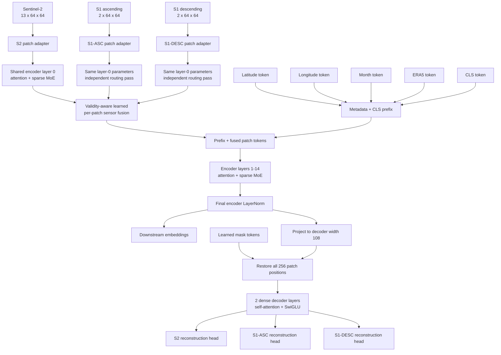
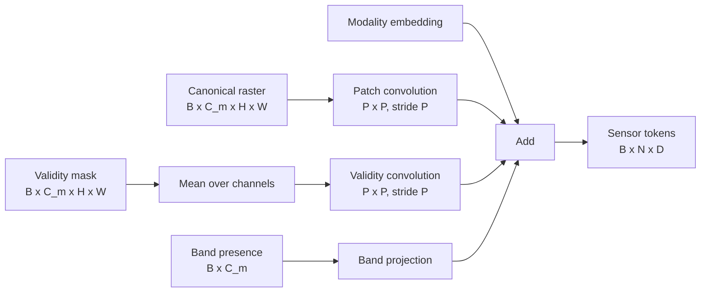
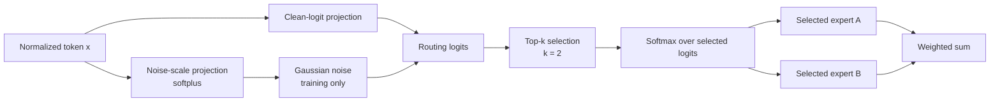
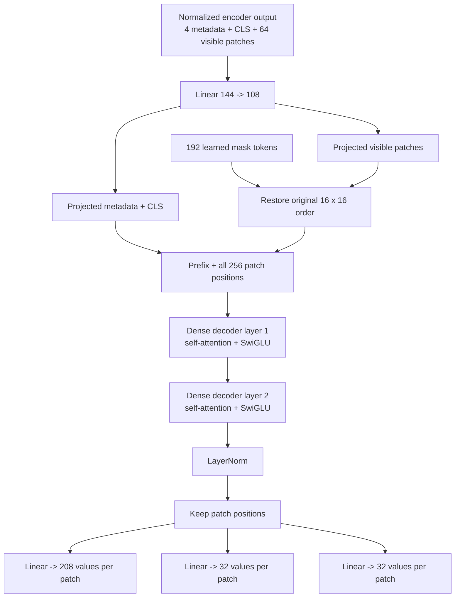
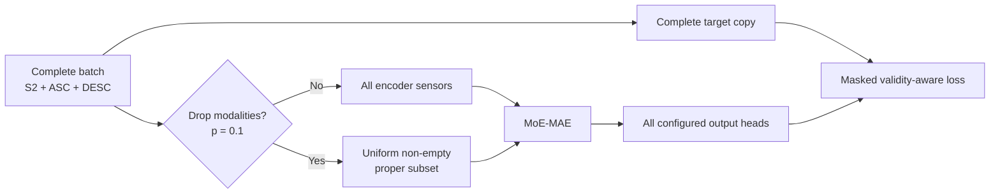
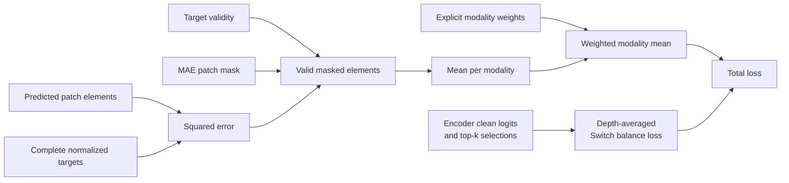

# Model and Pretraining Notes

This document describes the active multimodal MoE-MAE architecture and its
MMEarth64 pretraining strategy. It distinguishes behavior implemented by the model
from behavior that is merely possible in principle.

The source of truth is:

- [`models/moe_mae.py`](models/moe_mae.py) for the encoder, MoE, fusion, and decoder.
- [`datasets/mmearth.py`](datasets/mmearth.py) for loading, normalization, and validity.
- [`pretrain_mae.py`](pretrain_mae.py) for losses, masking, optimization, and validation.
- [`scheduler/schedulers.py`](scheduler/schedulers.py) for the LR schedule.
- [`configs/pretrain_mmearth_moe_mae_full.yaml`](configs/pretrain_mmearth_moe_mae_full.yaml)
  for the active full-scale configuration.

Code links below include line anchors for the current implementation. The class or
function name should be treated as the stable reference if later edits move a line.

## Contents

1. [Active full-scale configuration](#1-active-full-scale-configuration)
2. [Architecture overview](#2-architecture-overview)
3. [Tensor geometry](#3-tensor-geometry-for-mmearth64)
4. [Data normalization and validity](#4-data-normalization-and-validity)
5. [Metadata tokens](#5-metadata-tokens)
6. [Axial 2D RoPE](#6-axial-2d-rope)
7. [Encoder structure](#7-encoder-structure)
8. [Sparse MoE and routing](#8-sparse-moe-and-routing)
9. [Sensor fusion](#9-validity-aware-sensor-fusion)
10. [Dense decoder](#10-dense-lightweight-decoder)
11. [Masking and missingness](#11-masking-and-missingness-mechanisms)
12. [Reconstruction loss](#12-reconstruction-targets-and-loss)
13. [MoE balance loss](#13-moe-load-balancing-loss)
14. [Total objective](#14-total-objective)
15. [Optimization and weight decay](#15-optimization-and-weight-decay)
16. [Dataset splits and loading](#16-dataset-splits-and-data-loading)
17. [Deterministic validation](#17-deterministic-validation)
18. [Forward-pass pseudocode](#18-forward-pass-pseudocode)
19. [Inference and embeddings](#19-inference-and-embeddings)
20. [Full pretraining command](#20-full-pretraining-command)
21. [Enabled and disabled mechanisms](#21-enabled-and-disabled-mechanisms)
22. [Current limitations](#22-current-limitations-and-claim-boundaries)

## 1. Active Full-Scale Configuration

The full run uses MMEarth64 with these inputs.

| Input | Channels | Bands or variables | Role |
|---|---:|---|---|
| Sentinel-2 | 13 | B1, B2, B3, B4, B5, B6, B7, B8A, B8, B9, B10, B11, B12 | Raster input and target |
| S1 ascending | 2 | VV, VH | Raster input and target |
| S1 descending | 2 | VV, VH | Raster input and target |
| Latitude | 2 | sin, cos | One metadata token |
| Longitude | 2 | sin, cos | One metadata token |
| Month | 2 | sin_month, cos_month | One metadata token |
| ERA5 | 12 | Temperature and precipitation summaries | One metadata token |

The MMEarth modality definitions live in
[`MMEarthDataset`](datasets/mmearth.py#L42). The full-run selection is in the
[`full YAML`](configs/pretrain_mmearth_moe_mae_full.yaml).

```yaml
model:
  size: S
  img_size: 64
  patch_size: 4
  moe_balance_weight: 0.01

training:
  epochs: 50
  batch_size: 128
  val_batch_size: 128
  learning_rate: 0.0003
  warmup_ratio: 0.05
  weight_decay: 0.05
  structured_modality_dropout_prob: 0.1
  validation_mask_seed: 44
```

Fixed defaults in [`MOEMAE`](models/moe_mae.py#L946) are:

| Setting | Value |
|---|---:|
| MAE mask ratio | 0.75 |
| Decoder depth | 2 |
| Decoder width | 108 |
| Decoder heads | 6 |
| Decoder SwiGLU hidden width | 54 |
| Encoder and decoder dropout | 0.1 |
| Router top-k | 2 |
| Expert adapter rank | 8 |

## 2. Architecture Overview

The encoder delays sensor fusion by one shared transformer-MoE layer. Sensors are
first processed independently with shared parameters, then fused per spatial patch.
Metadata and CLS tokens are introduced only after fusion.



The delayed-fusion forward path is implemented in
[`MOEEncoder._encode_modalities`](models/moe_mae.py#L769). The MAE path is in
[`MOEMAE`](models/moe_mae.py#L946).

The active architecture does **not** contain coarse tokens, geographic polynomial
biases, metadata FiLM, dispatch guards, expert capacity pruning, position losses,
structural router-logit subtraction, or decoder cross-attention.

## 3. Tensor Geometry for MMEarth64

For `64 x 64` inputs and `4 x 4` patches:

```text
patch grid       = 16 x 16
number of patches = 256
mask ratio        = 0.75
visible patches   = int(256 * 0.25) = 64
masked patches    = 192
```

For model size `S`, encoder width `D = 144`.

| Stage | Pretraining shape |
|---|---|
| Prepared S2 | `[B, 13, 64, 64]` |
| Prepared S1 stream | `[B, 2, 64, 64]` |
| Tokens per sensor before masking | `[B, 256, 144]` |
| Visible tokens per sensor | `[B, 64, 144]` |
| Layer-0 output per sensor | `[B, 64, 144]` |
| Fused visible patches | `[B, 64, 144]` |
| Metadata tokens | `[B, 4, 144]` |
| CLS token | `[B, 1, 144]` |
| Encoder layers 1-14 input | `[B, 69, 144]` |
| Decoder prefix memory | `[B, 5, 108]` |
| Restored decoder patches | `[B, 256, 108]` |
| Full decoder sequence | `[B, 261, 108]` |
| S2 output | `[B, 256, 208]` |
| Each S1 output | `[B, 256, 32]` |

The output dimensions are `4 * 4 * 13 = 208` for S2 and `4 * 4 * 2 = 32`
for each S1 stream. Output heads are created in
[`MOEMAE.__init__`](models/moe_mae.py#L949).

Downstream embedding inference does not apply MAE masking. All 256 patches are
processed, so the fused encoder sequence contains `4 + 1 + 256 = 261` tokens.

## 4. Data Normalization and Validity

### 4.1 Normalization

The active configuration uses per-band z-score normalization:

$$
\hat{x}_{m,c} = \frac{x_{m,c} - \mu_{m,c}}{\sigma_{m,c}}.
$$

The implementation is
[`MMEarthDataset._normalize_modality`](datasets/mmearth.py#L387). Sentinel-2 selects
L1C or L2A statistics from tile metadata. S1 ascending and descending use the
correct channel offsets into the shared stored Sentinel-1 tensor.

Nodata handling is explicit:

1. Detect non-finite and modality-specific nodata values.
2. Preserve a boolean validity mask.
3. Normalize values.
4. Replace invalid values with `fill_value`, currently `0.0`.

Detection is in
[`_build_invalid_mask`](datasets/mmearth.py#L415), and values plus validity are
returned by
[`_process_modality_with_validity`](datasets/mmearth.py#L484).

A valid normalized zero and an unavailable value may have the same numeric value,
but their validity masks remain different. This prevents zero filling from silently
turning missing observations into valid measurements.

### 4.2 Runtime band canonicalization

[`MOEEncoder._prepare_modality_tensor`](models/moe_mae.py#L575) maps supplied runtime
bands to a canonical configured channel order. If fewer bands are supplied using
`raster_band_names` or `raster_band_indices`:

```text
present canonical channel -> supplied value, validity 1, band-presence 1
missing canonical channel -> value 0, validity 0, band-presence 0
```

Duplicate, unknown, and out-of-range bands are rejected. Every supplied modality in
one call must share batch size and spatial dimensions.

### 4.3 Patch adapter

Each sensor has its own lightweight adapter, built in
[`MOEEncoder.__init__`](models/moe_mae.py#L363) and applied in
[`_prepare_modality_tokens`](models/moe_mae.py#L667).

For sensor `m` and patch `i`:

$$
t_{m,i} = \operatorname{ConvPatch}_m(x_m)_i
          + \operatorname{ConvValid}_m(v_m)_i
          + e_m
          + \operatorname{LinearBand}_m(b_m).
$$

- `ConvPatch` is a `P x P` convolution with stride `P`.
- `v_m` is validity averaged across canonical channels at every pixel.
- `ConvValid` encodes the patch's spatial validity pattern.
- `e_m` is a learned modality identity embedding.
- `b_m` is the sample's canonical band-presence vector.
- The band projection is repeated over spatial patches.



Validity projections start at zero, so the model learns their influence instead of
starting with a hard-coded missingness bias.

### 4.4 `primary_input_name`

For MMEarth, the first configured raster is primary, currently Sentinel-2. It chooses
which adapter is stored in base attributes rather than `ModuleDict` attributes and
which sensor receives a legacy tensor passed as `x`.

It does **not** force S2 to remain during modality dropout, change fusion weights,
or change reconstruction-loss weights. Input resolution is handled by
[`MOEEncoder._resolve_raster_inputs`](models/moe_mae.py#L532).

## 5. Metadata Tokens

Metadata construction is implemented in
[`MOEEncoder._build_metadata`](models/moe_mae.py#L706). Four separate tokens are
created:

```text
lat(2)   -> Linear(2, D)  -> latitude token
lon(2)   -> Linear(2, D)  -> longitude token
month(2) -> Linear(2, D)  -> month token
era5(12) -> Linear(12, D) -> ERA5 token
```

For metadata group `j`:

$$
u_j = W_j(x_j \odot v_j) + b_j + e_j^{\mathrm{type}}
      + \left(1 - \operatorname{mean}(v_j)\right)e_j^{\mathrm{missing}}.
$$

This represents fully and partially missing metadata explicitly. Metadata is not
averaged into one vector. It enters after fusion, so it cannot affect layer-0
sensor routing but can interact with fused patches in layers 1-14.

The dataset's `S2_DATE` string is returned for inspection by
[`MMEarthDataset.__getitem__`](datasets/mmearth.py#L552), but is not passed to the
model. Active time information is month plus ERA5. Hour and week are not used.

## 6. Axial 2D RoPE

Coordinates are created by
[`build_2d_positions`](models/moe_mae.py#L12), and RoPE is applied by
[`apply_2d_rope`](models/moe_mae.py#L33) inside
[`Attention`](models/moe_mae.py#L155).

The model does not add absolute position vectors to residual tokens. It rotates only
attention queries and keys:

$$
\operatorname{RoPE}(q,p) = q\cos(\theta_p)
                          + \operatorname{rotate}(q)\sin(\theta_p).
$$

The attention head is split into x- and y-coordinate rotary sections. Consequences:

- attention can use relative 2D geometry;
- MoE routers do not directly receive additive absolute-position vectors;
- visible tokens retain their original full-grid coordinates after MAE masking;
- the decoder uses the same coordinates after restoring all patch locations;
- metadata and CLS use coordinate `(0, 0)` and remain distinguished by token types.

The rotary width is the largest multiple of four not exceeding head width. `S` has
head width 18, so 16 features rotate and two remain unrotated. `XS` has head width
16, so all head features rotate. RoPE is parameter-free and supports variable grids.

## 7. Encoder Structure

### 7.1 Sizes and parameter counts

Model presets are defined in [`build_model`](models/moe_mae.py#L1104). Counts below
use the active 13+2+2 raster channels and four metadata groups.

| Size | Width | Depth | Heads | Encoder params | Decoder params | Total params |
|---|---:|---:|---:|---:|---:|---:|
| `XXS` | 108 | 9 | 6 | 871,028 | 172,208 | 1,043,236 |
| `XS` | 128 | 12 | 8 | 1,571,359 | 174,368 | 1,745,727 |
| `S` | 144 | 15 | 8 | 2,938,897 | 176,096 | 3,114,993 |

The active `S` decoder is 5.65% of total parameters.

### 7.2 Hidden and expert schedules

The MoE hidden width decreases linearly with depth. For `S`:

```text
layer:   0   1   2   3   4   5   6   7   8   9  10  11  12  13  14
hidden: 144 138 133 128 123 118 113 108 102  97  92  87  82  77  72
experts:  3   3   3   3   3   4   4   4   4   4   5   5   5   5   5
```

Other presets:

```text
XXS hidden:  81, 74, 67, 60, 54, 47, 40, 33, 27
XXS experts:  3,  3,  3,  4,  4,  4,  5,  5,  5

XS hidden:   96, 90, 84, 78, 72, 66, 61, 55, 49, 43, 37, 32
XS experts:   3,  3,  3,  3,  4,  4,  4,  4,  5,  5,  5,  5
```

### 7.3 Transformer-MoE layer

[`MoETransformerEncoderLayer`](models/moe_mae.py#L284) is pre-normalized:

$$
x' = x + \operatorname{Attention}(\operatorname{LN}_1(x)),
$$

$$
x_{out} = x' + \operatorname{MoE}(\operatorname{LN}_2(x')).
$$

The implementation supports grouped key/value heads, but active presets set key/value
heads equal to query heads.

### 7.4 Delayed fusion

Layer 0 is called independently for every available sensor:

```text
z_s2   = layer_0(tokens_s2)
z_asc  = layer_0(tokens_asc)
z_desc = layer_0(tokens_desc)
```

These calls share all attention, router, and expert parameters, while routes differ
because each call sees different tokens. After fusion, metadata and CLS are prepended
and layers 1 through `depth - 1` operate on the common sequence. See
[`_encode_modalities`](models/moe_mae.py#L769).

## 8. Sparse MoE and Routing

### 8.1 Noisy top-k router

Routing is implemented by
[`NoisyTopKGate`](models/moe_mae.py#L123). For token representation `x`, the router
computes clean logits and a learned noise scale:

$$
\ell = W_{\ell}x + b_{\ell},
$$

$$
s = \operatorname{softplus}(W_sx + b_s) + \epsilon.
$$

During training:

$$
\tilde{\ell} = \ell + \mathcal{N}(0,I)\odot s.
$$

During normal evaluation and embedding extraction:

$$
\tilde{\ell} = \ell.
$$

The largest `k=2` logits are selected. Softmax is applied only to those selected
logits, producing exactly two nonzero weights that sum to one.



There is no expert capacity limit and no token dropping. Every selected token is
executed. Sparse execution is implemented in
[`MoELayer.forward`](models/moe_mae.py#L247) with per-expert token indexing and
`index_add_`, not a specialized distributed MoE kernel.

Router noise defaults to the module's training state. Analysis can explicitly request
stochastic routing, but standard `model.eval()` inference is deterministic.

### 8.2 Lightweight shared experts

Experts use [`SwiGLU`](models/moe_mae.py#L84), assembled by
[`MoELayer`](models/moe_mae.py#L206):

$$
h_e = \operatorname{SiLU}(W_{g,e}x + b_{g,e})
      \odot \left(W_vx + A_{v,e}(x) + b_v\right),
$$

$$
E_e(x) = W_oh_e + A_{o,e}(h_e) + b_o.
$$

Within one layer:

- `W_v` and `W_o` are shared across experts.
- Each expert has a private gate projection `W_g`.
- Each expert has rank-8 residual adapters on value and output paths.
- Adapter down projections use Kaiming initialization.
- Adapter up projections start at zero.

Experts therefore begin with a common value/output path and learn lightweight
expert-specific residual functions. Shared matrices reduce parameter count, but also
mean healthy experts need not have orthogonal outputs.

For sparse gate `g`:

$$
\operatorname{MoE}(x_i)=\sum_{e=1}^{E}g_{i,e}E_e(x_i).
$$

Only the two selected experts contribute.

## 9. Validity-Aware Sensor Fusion

Fusion is implemented by
[`MOEEncoder._fuse_modalities`](models/moe_mae.py#L743). For spatial patch `i` and
available sensor `m`:

$$
a_{i,m}=w_f^T\operatorname{LN}(z_{i,m})+b_m+\log(q_{i,m}),
$$

where `q` is the fraction of valid sensor elements in the patch, clamped to `1e-6`.

$$
\alpha_{i,m}=\frac{\exp(a_{i,m})}{\sum_r\exp(a_{i,r})},
$$

$$
z_i=\sum_m\alpha_{i,m}z_{i,m}.
$$

Properties:

- Fusion weights are learned separately for every patch.
- The content scoring projection is shared across modalities.
- Each modality has one learned scalar bias.
- An omitted modality is absent from the fusion stack.
- A supplied but invalid patch is strongly downweighted when alternatives are valid.
- Weights sum to one over supplied modalities.

Fusion score weights and modality biases start at zero. For equally valid sensors,
the initial behavior is equal averaging; content-dependent deviations are learned.

If all supplied sensors are invalid at a patch, the clamped log-validity terms are
finite and softmax still produces a normalized mixture. Reconstruction validity
masks ensure unavailable targets do not contribute to loss.

## 10. Dense Lightweight Decoder

The decoder is constructed in [`MOEMAE.__init__`](models/moe_mae.py#L949), visible
tokens are restored by
[`_restore_decoder_tokens`](models/moe_mae.py#L1014), and the complete path is in
[`MOEMAE.forward`](models/moe_mae.py#L1025).



Each [`DenseTransformerLayer`](models/moe_mae.py#L334) is pre-normalized:

$$
y=x+\operatorname{Attention}(\operatorname{LN}_1(x)),
$$

$$
x_{out}=y+\operatorname{SwiGLU}(\operatorname{LN}_2(y)).
$$

The decoder uses width 108, six heads, hidden width 54, two layers, dropout 0.1,
and the same 2D RoPE strategy. Self-attention lets masked patches use visible patches,
metadata, and CLS. There is no separate cross-attention path.

The decoder consumes **post-norm** encoder output. The downstream embedding API
defaults to mean-pooled **pre-norm** fine tokens because that representation performed
better in this project's linear evaluations. Decoder memory and downstream embedding
selection are intentionally separate choices.

The former decoder MoE was removed because its balance loss was not optimized and a
decoder expert became starved. The current decoder has no routers or experts, so that
failure mode is structurally absent.

## 11. Masking and Missingness Mechanisms

These mechanisms must not be conflated.

| Mechanism | Used in current pretraining? | Granularity | Purpose |
|---|---|---|---|
| Spatial MAE patch masking | Yes, every batch | Aligned spatial patches | Contextual reconstruction |
| Structured modality dropout | Yes, probability 0.1 | Whole sensors | Missing-sensor robustness |
| Random band dropout | **No** | Individual bands | Not currently trained |
| Natural nodata masking | Yes, when present | Pixels, bands, metadata values | Exclude invalid observations and targets |
| Runtime named-band subset | API supports it | Individual bands | Flexible inference interface |

### 11.1 Spatial MAE masking

[`MOEMAE.random_masking`](models/moe_mae.py#L990) generates independent uniform
noise over patch indices for each sample, sorts it, and retains:

$$
N_{keep}=\operatorname{int}\left(N(1-r)\right).
$$

For `N=256` and `r=0.75`, 64 patches are visible and 192 are masked.

The same retained indices are gathered from every available sensor, so masking is
spatially aligned across S2 and both S1 streams. Different samples receive different
patch masks. The binary mask means:

```text
0 = visible encoder patch
1 = masked reconstruction patch
```

Only masked locations contribute to reconstruction loss. There is no separate loss
on visible patches.

Training uses the normal global Torch RNG. Validation passes a dedicated generator,
described in Section 17.

### 11.2 Structured modality dropout

The exact implementation is
[`_apply_structured_modality_dropout`](pretrain_mae.py#L285). Dropout is evaluated
once per training batch, not once per sample.

- Probability 0.9: retain all three sensors.
- Probability 0.1: uniformly select one non-empty proper subset.
- For three sensors, the six outcomes are three single-sensor and three two-sensor
  combinations.
- The selected sensor subset applies to the entire batch.
- No sensor, including `primary_input_name`, is forced to remain.

Conditional on dropout, each sensor appears in three of six subsets. Its approximate
absence frequency is therefore:

$$
0.1\times0.5=0.05,
$$

or 5% of training batches.

The training loop keeps separate input and target dictionaries in
[`train_epoch`](pretrain_mae.py#L356). Only encoder input is reduced. Targets are
built from the untouched complete batch.



Validation does not apply modality dropout.

### 11.3 Band masking

**Random individual-band masking or dropout is not applied in current pretraining.**

The active loader always requests all 13 configured S2 bands and VV/VH for each S1
stream. There is no `band_dropout_prob` in the YAML or training loop.

The model can still accept a named subset of configured bands. Missing canonical
channels are zero-padded and represented in band-presence and validity inputs. This
makes missing-band input structurally valid, but does not guarantee robust embeddings:
arbitrary band subsets were not explicitly sampled as a training augmentation.

Current checkpoints are built for 13 S2 channels and two channels per S1 stream.
Unconfigured bands such as S1 HH/HV cannot be reconstructed by these heads without
changing the architecture and training compatible weights.

## 12. Reconstruction Targets and Loss

Targets are built by [`_build_patch_targets`](pretrain_mae.py#L266). Normalized
rasters and validity masks are unfolded into non-overlapping patch vectors:

```text
target Y_m:   [B, N, P*P*C_m]
prediction:   [B, N, P*P*C_m]
validity V_m: [B, N, P*P*C_m]
MAE mask M:   [B, N]
```

The loss implementation is
[`_compute_patch_loss`](pretrain_mae.py#L318).

For modality `m`, valid masked-element count is:

$$
D_m=\sum_{b,i,j}M_{b,i}V_{m,b,i,j}.
$$

Per-modality masked MSE is:

$$
L_m=\frac{\sum_{b,i,j}M_{b,i}V_{m,b,i,j}
                (\hat{Y}_{m,b,i,j}-Y_{m,b,i,j})^2}
               {\max(D_m,1)}.
$$

This averages over valid patch elements. S2 does not dominate merely because its
target vector has 208 elements while an S1 target has 32.

Let `w_m` be the configured modality weight. A modality is active only if `D_m > 0`:

$$
L_{rec}=\frac{\sum_mw_m\mathbf{1}[D_m>0]L_m}
               {\max(\sum_mw_m\mathbf{1}[D_m>0],1)}.
$$

The current weights are all one, so reconstruction is the mean of active S2,
S1-ASC, and S1-DESC losses.

There is no visible-patch reconstruction loss, per-patch target standardization,
spectral-angle loss, perceptual loss, or contrastive loss.

## 13. MoE Load-Balancing Loss

The layer loss is implemented by
[`MoELayer._balance_loss`](models/moe_mae.py#L240). Clean probabilities are:

$$
p_{i,e}=\operatorname{softmax}(\ell_i)_e.
$$

Mean clean probability and executed selection fraction are:

$$
P_e=\frac{1}{T}\sum_ip_{i,e},
$$

$$
F_e=\frac{1}{T}\sum_i\frac{\mathbf{1}[g_{i,e}>0]}{k}.
$$

`F_e` is detached, so gradients flow through `P_e` into clean router logits. For `E`
experts:

$$
L_{bal}^{(l)}=E_l\sum_eF_eP_e.
$$

A balanced router has loss near 1. Layer 0 runs separately for every available
sensor; its sensor losses are averaged first. Encoder losses are then averaged over
depth in [`_encode_modalities`](models/moe_mae.py#L769):

$$
L_{MoE}=\beta\frac{1}{L}\sum_{l=0}^{L-1}L_{bal}^{(l)},
\qquad\beta=0.01.
$$

Depth averaging keeps the auxiliary scale comparable across `XXS`, `XS`, and `S`.

The active objective has no separate importance loss, hard-load loss, position loss,
router entropy penalty, router z-loss, or modality-specialization penalty.

## 14. Total Objective

The complete objective in [`train_epoch`](pretrain_mae.py#L356) and
[`validate_epoch`](pretrain_mae.py#L441) is:

$$
L_{total}=L_{rec}+L_{MoE}.
$$



The decoder is dense, so every MoE auxiliary term comes from the encoder.

## 15. Optimization and Weight Decay

### 15.1 AdamW parameter groups

Weight-decay selection is implemented by
[`_uses_weight_decay`](pretrain_mae.py#L131), and optimizer construction is in
[`_build_adamw_optimizer`](pretrain_mae.py#L148).

The active optimizer is PyTorch AdamW:

```text
maximum learning rate = 3e-4
weight decay           = 0.05
Adam betas             = PyTorch defaults (0.9, 0.999)
Adam epsilon           = PyTorch default (1e-8)
```

A parameter receives decay only if it has more than one dimension and is not an
explicitly exempt learned token.

| Decayed | Not decayed |
|---|---|
| Attention matrices | All biases |
| Patch convolution kernels | LayerNorm scales and biases |
| Validity convolution kernels | CLS token |
| Router logit and noise matrices | Modality token embeddings |
| Expert gate/value/output matrices | Metadata type embeddings |
| Low-rank adapter matrices | Metadata missing embeddings |
| Metadata and band projection matrices | MAE mask token |
| Fusion scoring matrix | Fusion biases |
| Decoder projection, FFN, attention, heads | Other one-dimensional parameters |

For active model size `S`:

```text
decayed parameters:     3,081,008
non-decayed parameters:    33,985
total:                  3,114,993
```

AdamW decay is decoupled from the objective and is not part of the logged loss. There
are no layer-wise LR multipliers and no separate router or expert learning rates.

### 15.2 Mixed precision and gradients

The exact order is in [`train_epoch`](pretrain_mae.py#L356):

1. Set LR for the current global step.
2. Build complete targets and possibly modality-dropped model inputs.
3. Zero optimizer gradients.
4. Run CUDA autocast forward and loss computation.
5. Scale loss and run backward.
6. Unscale gradients.
7. Clip global gradient norm to `1.0`.
8. Take the AdamW step and update `GradScaler`.

Training stops if total loss is NaN or infinite. CUDA uses mixed precision; the code
does not enable autocast on CPU or MPS.

### 15.3 Step-based learning-rate schedule

Warmup-step resolution is in
[`_resolve_warmup_steps`](pretrain_mae.py#L141). The schedule itself is
[`WarmupCosineLR`](scheduler/schedulers.py#L12).

For total optimizer steps `T` and `W = int(T * warmup_ratio)`:

$$
lr(t)=lr_{max}\frac{t}{W},\quad t<W,
$$

$$
lr(t)=\frac{1}{2}lr_{max}
\left(1+\cos\left(\pi\frac{t-W}{T-W}\right)\right),\quad t\ge W.
$$

With `warmup_ratio: 0.05`, the first 5% of optimizer steps are warmup. Step zero uses
LR zero; step `W` reaches `3e-4`; the remainder decays toward zero.

On resume, the scheduler is reconstructed from configured total epochs. Global step
is inferred from epoch and batch index. Scheduler state is not separately stored.
Changing total epochs while resuming changes the cosine curve and can cause an LR
discontinuity, so a fresh run is preferable after a major schedule change.

## 16. Dataset Splits and Data Loading

Dataset construction is in
[`_build_mmearth_train_val_datasets`](pretrain_mae.py#L543). Split behavior is in
[`MMEarthDataset._build_split_indices`](datasets/mmearth.py#L283).

The active configuration is:

```yaml
fallback_split_from_train: true
val_fraction: 0.01
test_fraction: 0.0
split_seed: 42
```

Fallback is used only when both official validation and test lists are empty. In that
case, official training indices are deterministically permuted and 1% is assigned to
validation. If official val or test indices exist, they are used unchanged.

Subset experiments apply a second deterministic sample limit through
[`_maybe_limit_dataset`](pretrain_mae.py#L603). The full configuration has no train
or validation sample limit.

[`_make_loader`](pretrain_mae.py#L497) configures:

| Setting | Train | Validation |
|---|---|---|
| Batch size | 128 | 128 |
| Shuffle | Yes | No |
| Workers | 6 | 6 |
| Pinned memory | Yes | Yes |
| Persistent workers | Yes | Yes |
| Prefetch factor | 4 | 4 |

Python, NumPy, Torch CPU, and all CUDA RNGs are seeded by
[`_seed_everything`](pretrain_mae.py#L41) with seed 42. The training loader generator
uses seed 42; the validation loader generator uses 43.

The pretraining script infers dimensions from the first sample and currently requires
square pretraining rasters. The encoder itself accepts rectangular runtime inputs if
height and width are divisible by patch size.

## 17. Deterministic Validation

Validation is implemented in [`validate_epoch`](pretrain_mae.py#L441).

- `model.eval()` disables dropout and default router noise.
- Modality dropout is not applied.
- MAE masking remains active at 75%.
- A CPU mask generator is reset to seed 44 at every validation epoch.
- Validation order is fixed.

Therefore each epoch sees the same sequence of validation patch masks. Best-checkpoint
selection is not confounded by a fresh random masking draw each epoch.

Best weights minimize total validation loss:

$$
L_{val,total}=L_{val,rec}+L_{val,MoE}.
$$

Checkpoint dictionaries are created by
[`_checkpoint_state`](pretrain_mae.py#L532). Run outputs are:

| Artifact | Meaning |
|---|---|
| `pretrained_S_best.pth` | Lowest total validation loss |
| `pretrained_S_last.pth` | Final completed epoch |
| `checkpoint_S.pth` | Rolling resumable checkpoint |
| `checkpoint_S_epoch_XXX.pth` | Requested milestone checkpoint |
| `training_metrics_S.csv` | Train/validation metrics and average LR |
| `config_resolved.yaml` | Effective configuration |
| `run_manifest.json` | Git commit, command, environment, seeds, schedule, parameter counts |

The optimizer-layout identifier rejects checkpoints from incompatible architectures,
including the former MoE decoder.

## 18. Forward Pass Pseudocode

The following pseudocode mirrors
[`MOEMAE.forward`](models/moe_mae.py#L1025) and
[`MOEEncoder._encode_modalities`](models/moe_mae.py#L769):

```python
# 1. Canonicalize channels and create validity/band indicators.
prepared = prepare_raster_inputs(raster_dict, validity, band_names)

# 2. Create one full patch-token grid per supplied sensor.
sensor_tokens = {
    name: patch_conv(values)
          + validity_conv(validity_fraction)
          + modality_embedding
          + band_presence_projection
    for name in supplied_sensors
}

# 3. Generate one aligned spatial MAE mask per sample.
ids_keep, ids_restore, mask = random_masking(mask_ratio=0.75)
visible_sensor_tokens = gather(sensor_tokens, ids_keep)
visible_coordinates = gather(full_2d_coordinates, ids_keep)

# 4. Build one token per metadata group.
metadata_tokens = build_metadata(meta_dict, meta_valid_masks)

# 5. Reuse encoder layer 0 independently for every supplied sensor.
prefusion = {
    name: encoder_layer_0(tokens, positions=visible_coordinates)
    for name, tokens in visible_sensor_tokens.items()
}

# 6. Fuse sensors per visible patch using content and validity.
fused_visible = gated_sensor_fusion(prefusion, visible_patch_validity)

# 7. Add metadata and CLS, then run remaining encoder layers.
encoder_sequence = concat(metadata_tokens, cls_token, fused_visible)
for layer in encoder_layers[1:]:
    encoder_sequence = layer(encoder_sequence, positions)
encoded = final_layer_norm(encoder_sequence)

# 8. Project encoded memory to decoder width.
decoder_memory = decoder_embed(encoded)

# 9. Restore visible tokens and learned mask tokens to all patch locations.
decoder_patches = restore(decoder_memory.visible_patches, mask_token, ids_restore)
decoder_sequence = concat(decoder_memory.metadata_and_cls, decoder_patches)

# 10. Run two dense decoder layers and one head per configured sensor.
for layer in dense_decoder_layers:
    decoder_sequence = layer(decoder_sequence, full_grid_positions)
decoded_patches = decoder_norm(decoder_sequence).patch_positions
predictions = {name: head[name](decoded_patches) for name in configured_sensors}

# 11. Compute valid masked MSE per modality and add encoder MoE balance.
loss = weighted_mean(per_modality_masked_mse) + encoder_moe_loss
```

## 19. Inference and Embeddings

Embedding extraction delegates from
[`MOEMAE.extract_embedding`](models/moe_mae.py#L987) to the encoder pooling logic
following [`MOEEncoder.forward_features`](models/moe_mae.py#L853).

```python
model.eval()
embedding = model.extract_embedding(
    raster_dict=raster_dict,
    raster_valid_masks=raster_valid_masks,
    raster_band_names=raster_band_names,
    meta_dict=meta_dict,
    meta_valid_masks=meta_valid_masks,
    token_source="pre_norm",
    pooling="mean_fine",
)
```

Token sources:

- `pre_norm`: immediately before final encoder LayerNorm; current default.
- `post_norm`: after final encoder LayerNorm.

Pooling modes:

- `mean_fine`: mean of patch tokens; recommended starting point.
- `cls`: CLS token only.
- `mean_all`: mean of metadata, CLS, and patch tokens.

Standard inference is deterministic. The API accepts:

- any non-empty subset of configured sensors;
- named subsets of configured bands;
- missing or partial metadata with validity masks;
- rectangular spatial grids divisible by patch size.

All modalities supplied together must already share spatial dimensions. The model
does not resample sensors internally.

## 20. Full Pretraining Command

To suppress tqdm's stderr progress bars while retaining stdout epoch messages:

```bash
nohup python -u pretrain_mae.py \
  --config_yaml configs/pretrain_mmearth_moe_mae_full.yaml \
  > pretrain_mmearth64_full_dense_decoder.out 2>/dev/null &
```

Because tqdm writes batch progress to stderr, `2>/dev/null` removes batch-level
progress. Epoch summaries remain in stdout, and the metrics CSV is flushed after
every epoch.

```bash
tail -n 30 pretrain_mmearth64_full_dense_decoder.out
tail -n 5 outputs/pretraining/training_metrics_S.csv
```

The entry point and checkpoint loop are in [`main`](pretrain_mae.py#L661).

## 21. Enabled and Disabled Mechanisms

| Mechanism | Status | Code reference |
|---|---|---|
| Sensor-specific patch projections | Enabled | [`MOEEncoder`](models/moe_mae.py#L360) |
| Raster validity masks | Enabled | [`_prepare_modality_tensor`](models/moe_mae.py#L575) |
| Metadata validity masks | Enabled | [`_build_metadata`](models/moe_mae.py#L706) |
| Runtime missing-band indicators | Enabled | [`_prepare_modality_tokens`](models/moe_mae.py#L667) |
| Random band dropout | Disabled | No training implementation |
| Structured modality dropout | Enabled, p=0.1 | [`_apply_structured_modality_dropout`](pretrain_mae.py#L285) |
| Aligned spatial patch masking | Enabled, 75% | [`random_masking`](models/moe_mae.py#L990) |
| Delayed sensor fusion | Enabled | [`_encode_modalities`](models/moe_mae.py#L769) |
| Learned per-patch fusion | Enabled | [`_fuse_modalities`](models/moe_mae.py#L743) |
| Separate metadata tokens | Enabled | [`_build_metadata`](models/moe_mae.py#L706) |
| Axial 2D RoPE | Enabled | [`apply_2d_rope`](models/moe_mae.py#L33) |
| Additive absolute positions | Disabled | RoPE is used instead |
| Sparse encoder MoE | Enabled, top-2 | [`MoELayer`](models/moe_mae.py#L206) |
| Training router noise | Enabled | [`NoisyTopKGate`](models/moe_mae.py#L123) |
| Evaluation router noise | Disabled by default | [`NoisyTopKGate.forward`](models/moe_mae.py#L136) |
| Shared expert value/output | Enabled | [`MoELayer.__init__`](models/moe_mae.py#L209) |
| Rank-8 expert adapters | Enabled | [`SwiGLU`](models/moe_mae.py#L84) |
| Encoder balancing loss | Enabled, weight 0.01 | [`_encode_modalities`](models/moe_mae.py#L769) |
| Position-routing loss | Disabled | No active implementation |
| Expert capacity/token dropping | Disabled | Every top-k route executes |
| Coarse tokens | Disabled | No active implementation |
| Geographic polynomial bias | Disabled | No active implementation |
| Metadata FiLM | Disabled | Metadata uses tokens |
| Dense decoder | Enabled | [`DenseTransformerLayer`](models/moe_mae.py#L334) |
| Decoder MoE | Disabled | Decoder is dense |
| Decoder cross-attention | Disabled | Decoder uses self-attention |

## 22. Current Limitations and Claim Boundaries

1. Missing-band inputs are structurally supported but random band dropout is not
   trained. Band-subset robustness must be measured rather than assumed.
2. Modality dropout is batch-level, so all samples in a dropped batch use the same
   sensor combination. This is efficient but provides fewer combinations per step
   than per-sample dropout.
3. A naturally missing sensor should be omitted from `raster_dict`. A supplied but
   fully invalid sensor still creates missingness-aware tokens, although fusion
   suppresses it when another valid sensor exists.
4. Decoder heads reconstruct only configured channels. Adding sensors or bands changes
   adapters and heads and requires compatible training.
5. Supplied modalities must already share spatial dimensions. The model performs no
   sensor-specific resampling or physical-resolution alignment.
6. Variable downstream spatial dimensions are architecturally supported, but active
   pretraining uses only the 64x64 MMEarth64 grid. That is not evidence of learned
   multi-scale invariance.
7. Load balancing prevents starvation but does not guarantee human-readable semantic
   experts. Specialization requires routing statistics, causal expert ablations,
   spatial labels, and downstream tasks.
8. Single-sensor cross-modal reconstruction is harder than reconstruction when the
   target sensor is present. At p=0.1 modality dropout, each sensor is absent in only
   about 5% of batches; cross-sensor generation is secondary to representation
   learning.
9. Sparse dispatch is local and loop-based. Scaling expert count or distributing
   experts across devices would require a more specialized dispatch implementation.
10. Validation fixes the mask sequence for checkpoint comparability, but one sequence
    is still one Monte Carlo realization. Final reporting can average several mask
    seeds without changing best-checkpoint training behavior.

These limits define which conclusions need empirical evaluation; they do not by
themselves indicate model failure.
